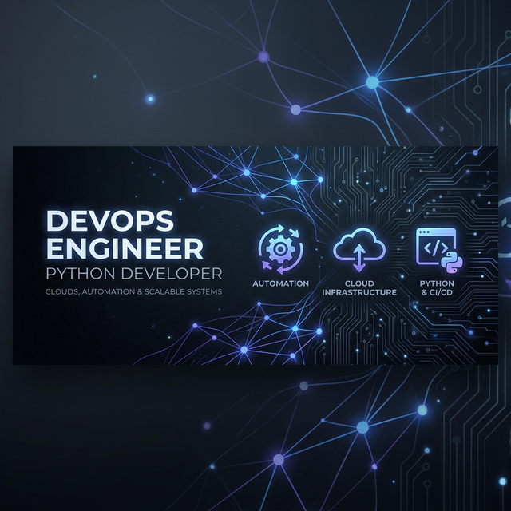

  

# Hi there, I'm Rakesh Gollapalli 👋

### 🚀 DevOps Engineer & Python Developer
I specialize in building robust CI/CD pipelines, automating infrastructure, and developing data-driven applications. I have a strong interest in Financial Technology (FinTech) and am currently building tools for market analysis and portfolio management.

---

### 🏆 GitHub Trophies

---

### 🛠️ My Tech Stack

| Category | Tools & Technologies |
| :--- | :--- |
| **Languages** |    |
| **DevOps** |    |
| **Frameworks** |   |
| **Finance** |  |

---

### 🌟 Featured Highlights

- **[Live Portfolio Dashboard](https://github.com/rakeshgollapalli8/stock-devops-project)**: CI/CD integrated tracking for Indian market trends and portfolio analytics.
- **[Automation Suite](https://github.com/rakeshgollapalli8)**: High-performance scripts for CI/CD optimization and data processing.

---

### 📈 GitHub Stats

  
  

---

### 🐍 Contribution Activity

---

### 📫 Connect with Me
- **LinkedIn**: [Rakesh Gollapalli](https://www.linkedin.com/in/rakeshgollapalli/)
- **Email**: [rakesh.gollapalli5@gmail.com](mailto:rakesh.gollapalli5@gmail.com)
